# unity-xyz
a lightweight c# XYZ tile viewer.

###disclaimer
This is a side project to learn c# and Unity which implies that the quality of the code as well as the structure might not be as good as you would expect from a regular lib.
I don't have a clue clue what Unity good practices are and discover things almost by accident.

I won't polish it much, it will keep changing and if you're willing to use in produciton, do so at your own risks.
Anyway, there are very high chances that you'll have to rebuild everything from scratch :)

I didn't include the Standard Assets, they are required if you 

##usage
the XYZ maps use a very efficient way of storing and naming square tiles which is suited for displaying huge maps at different scales (zoom levels).
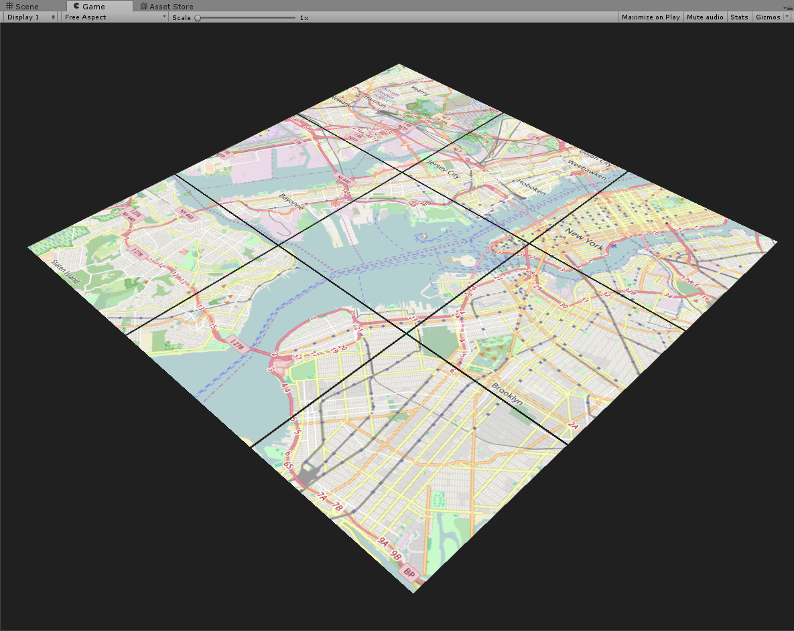
_many disjoint tiles are used to create a bigger map_
so basically, this API loads a given set of tiles, builds meshes and position them in space. if you want to learn more about the subject, you can check this [slide deck (in french)](http://barradeau.com/projects/cartography/slides/#/) and the [associated resources](https://github.com/nicoptere/cartography). 

To use the API, you'll need to add the `MapObject` component to an object in the hierarchy. The component should look like this:
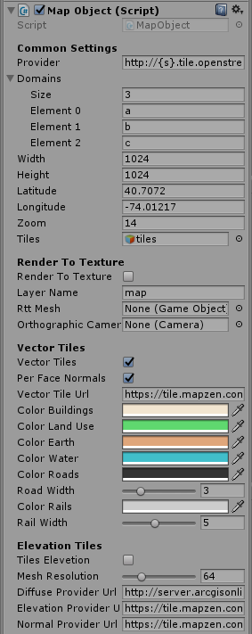

##Common Settings
the first seven parameters are mandatory:

  * provider: the address of the tile provider, by default [http://{s}.tile.openstreetmap.org/{z}/{x}/{y}.png](http://{s}.tile.openstreetmap.org/{z}/{x}/{y}.png) the `{x}`, `{y}`, `{z}` are replaced by the tile's actual coordinates and `{s}` is replaced by one of the subdomains if needed. 
  * the prodvider's subdomains ; not always required but some providers serve tiles from multiple servers, if not null, each tile will randomly pick one of the provided subdomains to build its url.
  * width: the width of the viewport, the area we want to cover with tiles in 3d units or "pixels".
  * height: the height of the viewport, the area we want to cover with tiles in 3d units or "pixels".
  * latitude: the latitude of the center of the view rect in degrees 
  * longitude: the longitude of the center of the view rect in degrees
  * zoom: the zoom level or "scale" of the map, usually nevers goes beyond 19.
  
the above parameters are required to display something on screen. Note that the provider will be overridden if you use the elevations tiles.

##Render To Texture (RTT)
most of the time we'll need a texture of the map instead of quads floating all over the place. this can be achieved by checking the `render to texture` checkbox below:
;
this gives you a single square texture drawn on a single quad ; all tiles are downloaded separately and stiched on update. if you need a simple map, that's probably the best option.

 * you'll need to apply a culling mask to the main camera ; the layer's name is `map`, you cna change it in the settings panel. 
 * the `rttMesh` gameObject is a public member of MapObject, not sure if it's of any help, the idea was to make it available to other classes.
 * the `tiles` gameObject is sent far away offscreen, not to clog the scene view.

you should get something like this:
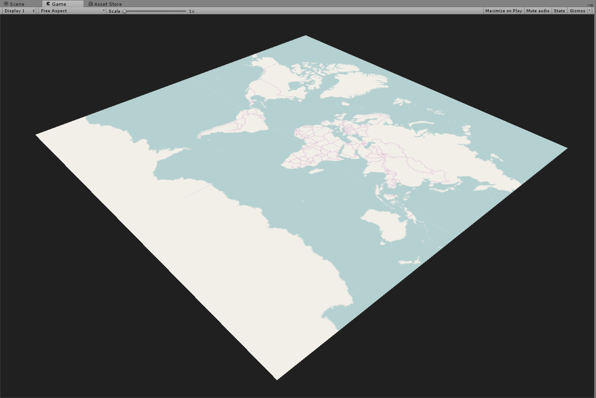
or this:
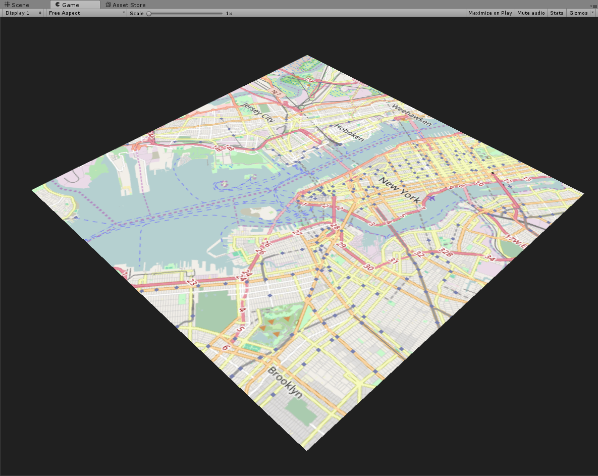
notice how the map gets "cropped" as we gets closer, the tiles however keep being positioned outside the quad. Unfortunately, I didn't manage to get rectangular RTT ; the orthographic camera didn't want to play nice.

##Vector Tiles
[Mapzen](https://mapzen.com/) is a fantastic tiles' provider ; they deliver most of their content for free and have a great R&D activity. the reason I mention this is because I use their tilesets to render vector tiles.

I would encourage you to [create a developper account](https://mapzen.com/documentation/overview/), it's free and as they merged all their APIS, a single key will allow you to use any of them, overmore their rate limits are just silly for a personal use.

under the vector tiles submenu, check `vector tiles` 
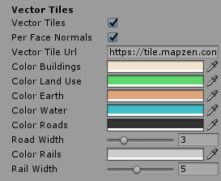;

* the `per face normals` bool will indicate whether or not you want to get a "flat" look, by default Unity will recompute per vertex normals giving the meshes a smooth look like this:

while if you activate `per face normals`, you'll get this:
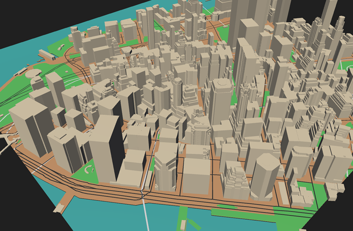
note that this is achieved by creating extra vertices, the meshes are therefore much heavier than they should.
* the vector tile provider : in my case Mapzen. the url contains the API key.
* the colors for the various features: Buildings, earth, land use, water, roads and rails.
* for the roads and rails (that are originally non renderable lines), the width at which it should be extruded.

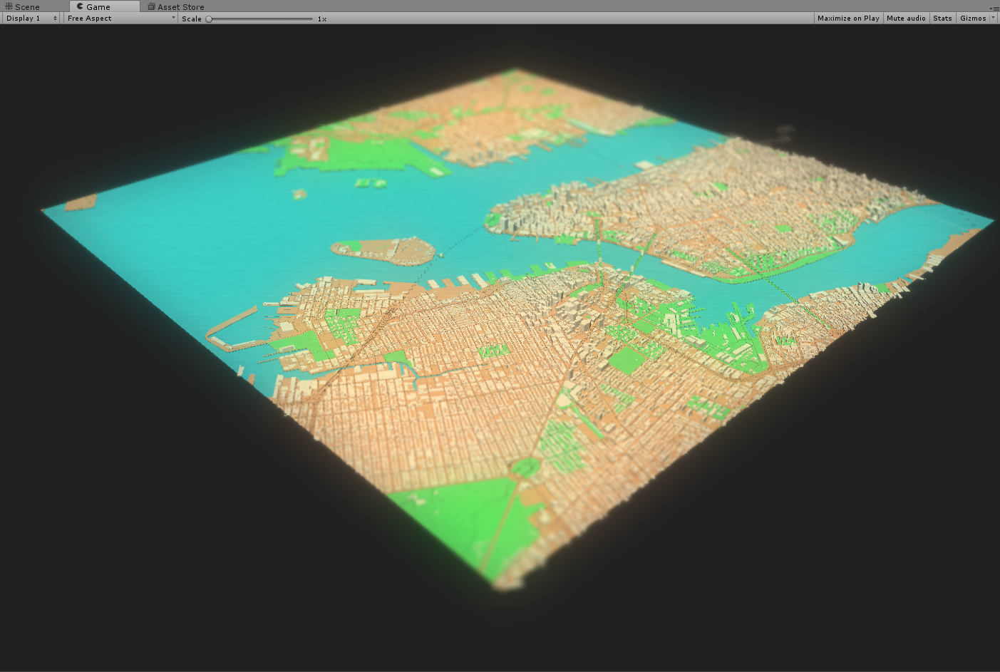

if you want to disable one of the features, set its color's alpha to 0.
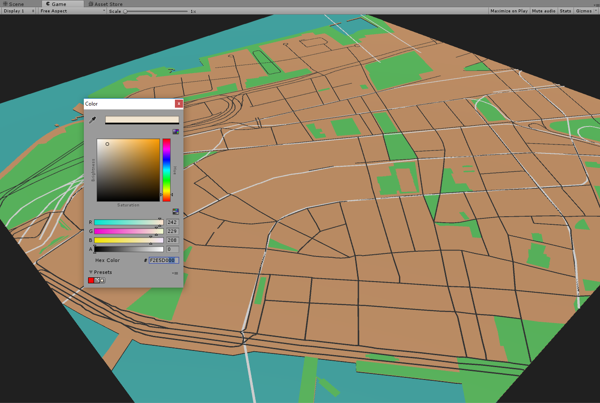
if you turn the colorBuildings' alpha to zero, they will not be built. 

##Elevation Tiles

This one is quite straight-forward, it also uses 2 tilesets from [Mapzen](https://mapzen.com/documentation/terrain-tiles/): terrarium and normal. it will load 2 to 3 tilesets ; first the elevation data, then the normals and / or the diffuse.
when we recieve the elevation data, we build a mesh that decodes and uses the elevation to set the Y position of each vertex. 
  
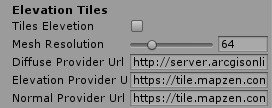;
under the elevation tiles submenu, check `elevation tiles` 

* the `Mesh Resolution` determines how precise the mesh will be.

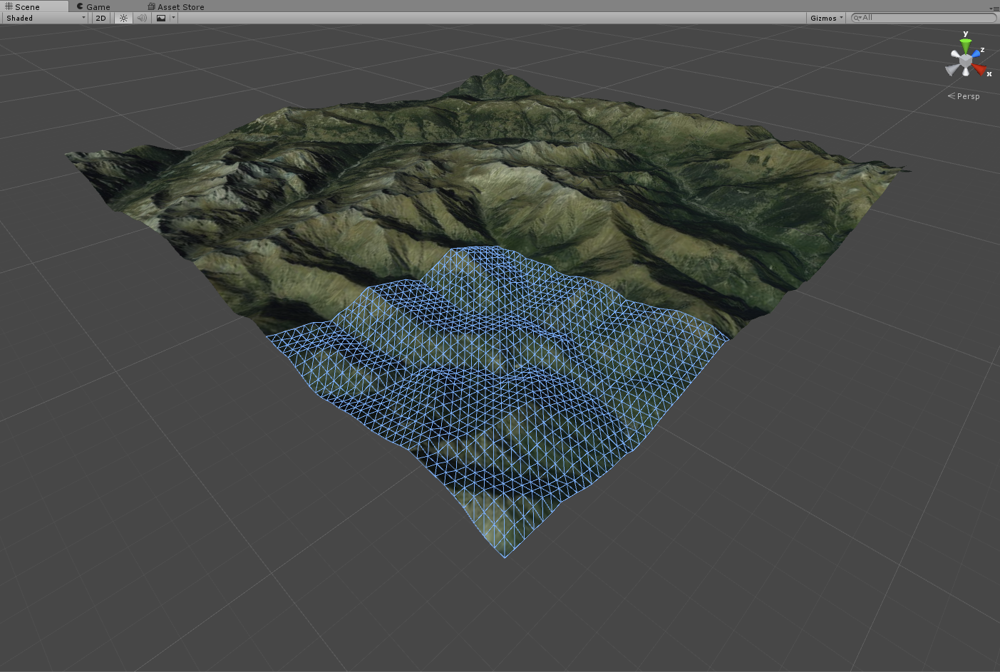

* the next three entries are provider urls for the diffuse, elevations and normals textures.
 
that's what it would look like
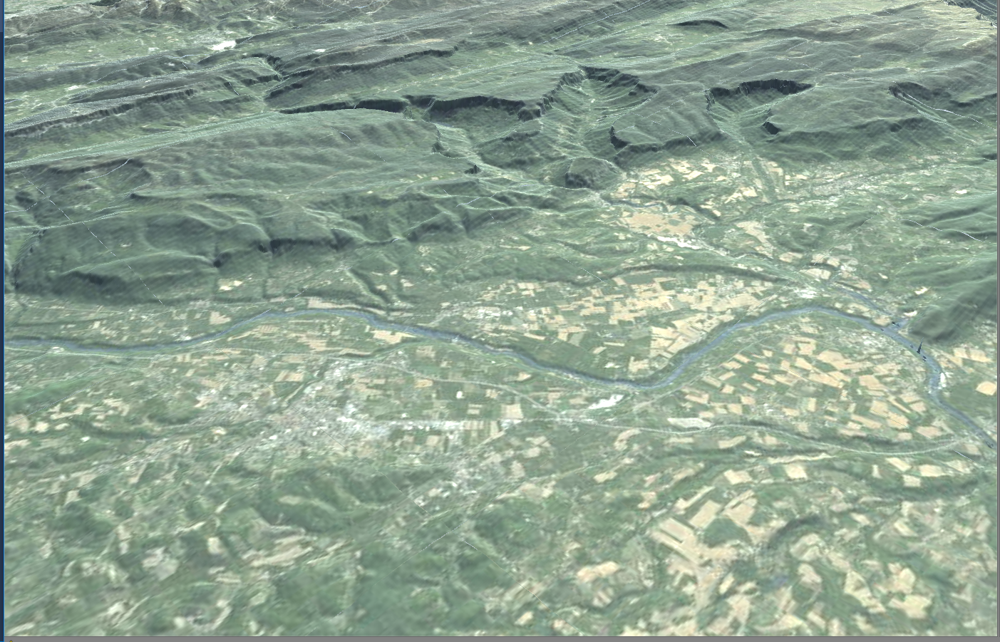

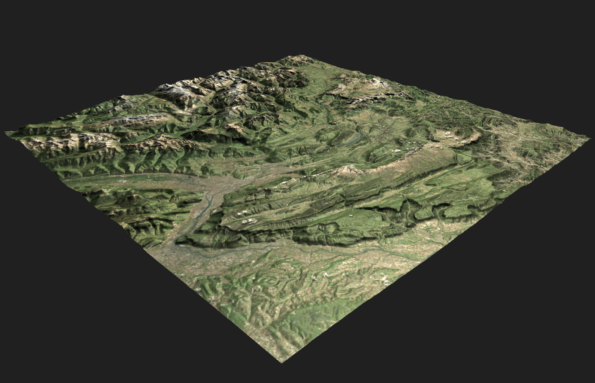
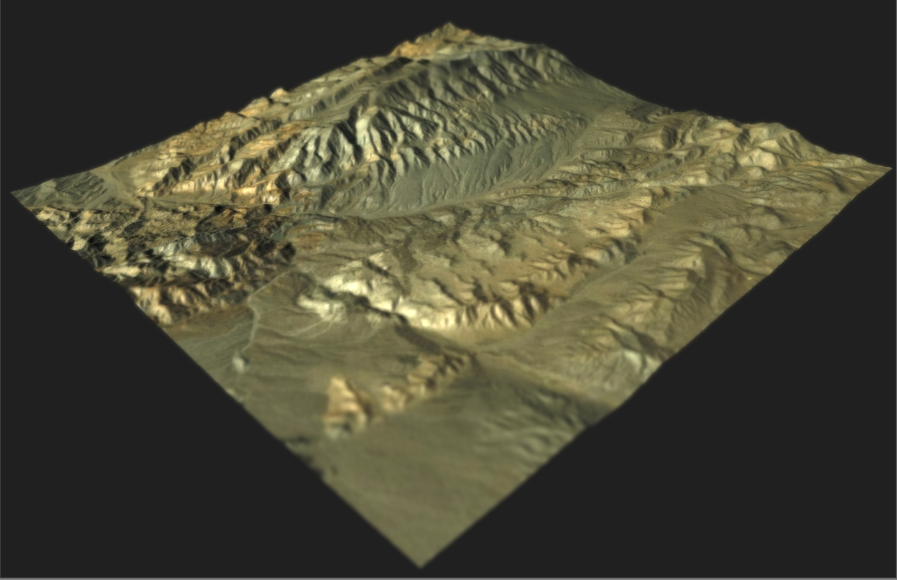

you'll notice creases between tiles, this comes from the precision of Floats, and sometimes from the tiles themselves
I'll try to solve the problem some day.
 

 
 

  

